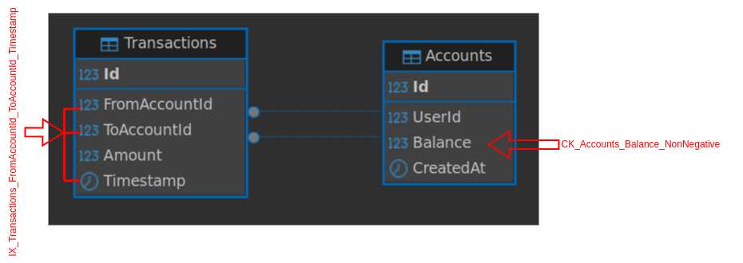
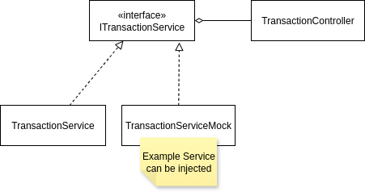

# 💸 Instant Money Transfer API (.NET 8 + PostgreSQL)

A reliable and safe **Instant Transfer Service** for fintech systems.  
Built with **.NET 8**, **PostgreSQL**, designed to handle high concurrency, duplicate requests, and system reliability challenges.

---

# Walkthrough

## Key Description

The implementation focuses on preserving **monetary correctness** (no lost or duplicated funds) and **safety under concurrency**, keeping in mind that this is a **microservice** — meaning the database might be shared and modified by other microservices.

For instance, a **Django** or **Spring** application might also have access to modify the account balances.

---

## Architecture Walkthrough

### Overview

The system is designed to expose REST endpoints for:

- **Account creation**
- **Money transfers between accounts**
- **User management**

Each user can own one or more accounts.  
A transaction is only accepted if it originates from the user who owns the source account.

---

### Implementation Progress

**What has been done:**

- Defined the **Account** and **Transaction** entities and migrated them to the database.  
- Added database constraints on the **Accounts** table to ensure that the balance never goes below zero.  
- Created REST endpoints as described in [API Endpoints](#api-endpoints).  
- Created a **unique index** on `(AccountId, ToAccountId, Timestamp)` for **idempotency**.

#### Transactions and Accounts Tables



**Why:**

The **Accounts** and **Transactions** tables were intentionally kept simple for this project.  
A constraint was added on the `Accounts.Balance` column to prevent negative balances.  
The unique index `(AccountId, ToAccountId, Timestamp)` ensures **idempotency** — preventing duplicate transaction entries.

Although idempotency could alternatively be achieved using a client-generated **idempotency key**, this would require additional logic on the client side.  
The current approach — using `IX_Transactions_FromAccountId_ToAccountId_Timestamp` ON `(AccountId, ToAccountId, Timestamp)` — is simpler and reliable, where the **Timestamp has to be send by the client in correct UTC format and the backend has to verify that the timestamp from the client is valid UTC time and isn't from future and is not far away from current time by certain defined delta**, effectively handling network hiccups and duplicate requests.


Tradeoff: Dependency on the client app to send valid UTC timestamp.
Benefit: Prevents duplicate transactions without making new column for idempotency-key, and relying on the client app to send valid idempotency-key.

WIP: checking valid time from the client side is not yet implemented in the system.


---

## Service Layer

Business logic resides in **services** (e.g., `TransactionService`), with controllers delegating to these services.  
Services then delegate persistence operations to repositories, following the **Controller–Service–Repository** pattern.

**What has been done:**

- Implemented REST API endpoints with all business logic initially in controllers.  
- Performed integration testing on endpoints and database reflection using PostgreSQL.  
- After reaching an **MVP**, refactored the code for better **decoupling and abstraction**, moving business logic into **injectable services** (e.g., `ITransactionService`).



**Why:**

Following **separation of concerns** improves testability and maintainability.  
By isolating business logic in abstract services and persistence logic in repositories (e.g., `IAccountRepository`), changes in one area do not affect others.


**Injected service example:**

```csharp
builder.Services.AddScoped<ITransactionService, TransactionService>();
```

tradeoff: Controller–Service–Repository pattern makes slightly more boilerplate.
benefit & why used: Clear separation of concerns

WIP: delegation of persistence operations to repositories.


---

## Persistence

**Used:** PostgreSQL with EF Core (Code-First approach)

**Why:**

- PostgreSQL provides strong **data integrity** and **ACID compliance**, both critical for financial transactions.  
- The **Code-First** approach simplifies database migrations and code sharing between dev environments.

The system relies on **pessimistic locking** for affected rows during transactions.  
This ensures reliability but can slow down concurrent requests involving the same accounts.

---

## Concurrency Control

Multiple money transfer requests can be processed concurrently, therefore **Pessimistic locking** had been used to avoid racing and data corruption.

### Example Transactions

**Transaction 1:**

```json
{
  "fromAccountId": 1,
  "toAccountId": 2,
  "amount": 50
}
```

**Transaction 2:**

```json
{
  "fromAccountId": 2,
  "toAccountId": 1,
  "amount": 300
}
```

In this case:

- **Transaction 1** locks rows 1 and 2.  
- **Transaction 2** is blocked until **Transaction 1** is completed or rolled back.

This design ensures **data reliability**, but trade-off are:

- it can lead to **busy waits** when accounts are involved in other ongoing transactions.  
- Since EF Core doesn’t natively support pessimistic locking, **raw SQL queries** are used for locking.

**Alternative Concurrency Techniques supported by EF:** and why not used.

***1. Row Versioning (Optimistic Concurrency)***

```csharp
[Timestamp]
public byte[] RowVersion { get; set; }
```

EF Core checks the `RowVersion` column during updates and fails if it has changed since the record was read.

**Why not used:**  
Other frameworks (e.g., Spring or Django) sharing the same database wouldn’t update this column, which could lead to data corruption.

***2. EF Core’s `[ConcurrencyCheck]` Attribute (Optimistic Concurrency)***

```csharp
[ConcurrencyCheck]
public decimal Balance { get; set; }
```

EF Core compares the `Balance` value before and after the transaction and fails if it has changed in between.

**Why not used:**  
This approach requires implementing a **retry mechanism** for failed transactions, increasing system complexity.

#### Decision

**Pessimistic locking** was chosen despite its trade-offs because it is:

- **Highly reliable**  
- **Framework-agnostic** (works regardless of EF Core, Spring Data, etc.)  
- **Safe for shared databases**

This approach ensures **data consistency** across all backend applications that share the same database.


---


# GettingStarted
## 🐳 Run with Docker
1- Start the Databse Server using docker
Notice Postgresql will the use latest OutputScript.sql from InstantTransfers and migrate it to the DB
```bash
cd postgresql
sudo docker compose up -d
```
2- Run the Service with Docker
```bash
## inside repo top dir
sudo docker build -t atlasbank_instant-transfer-service:1.0 .
sudo docker run -p 5149:8080 atlasbank_instant-transfer-service:1.0
```
Service would run now u can Access : http://localhost:5149/swagger/index.html
To test different cases 

## Run Service with kubernetes
before running the service start the database using docker compose from here : [Go to GettingStarted](#GettingStarted)
```bash
kubectl apply -f instanttransfers-deployment.yaml
kubectl get pods -n instanttransfers
```
Service would run now u can Access : http://localhost:5149/swagger/index.html
To test different cases 


## Run Tests
```bash
# inside repo top dir
dotnet build
dotnet test InstantTransfers.Tests
```

## Challenges & Solutions

### 1. **Concurrent Transfers**
**Problem:** Multiple transfers might target the same account at the same time, risking race conditions.  
**Solution:**  
1 - **row-level locking** is User via `SELECT ... FOR UPDATE` on the involved accounts to ensure only one **transaction** modifies the balances at a time.  
2 - Updates to account balances are done using **atomic SQL statements** (`UPDATE ... SET Balance = Balance ± X WHERE Balance >= X`)
instead of value retrieval from code
ex: 
```C#
    var acc1 = await _context.Accounts.FindAsync(id1);
    var acc2 = await _context.Accounts.FindAsync(id2);
    // some other workers could go and change the Balance values in one or both accounts 
    acc1.Balance = acc.Balance - 50;
    acc2.Balance = acc.Balance + 50;
    // then persist in the DB
```
in this case if row-level locking is not used Balance could go in undetrmined state. So both 1 and 2 are used to prevent concurrency issues.

3 - Accounts are locked in a **consistent order** (sorted by ID) to avoid deadlocks.


---

### 2. **Duplicate Requests (Idempotency)**
**Problem:** A merchant might retry a transfer due to a network hiccup or timeout, causing double-debits.  
**Solution:**  
- Simplest solution has been used, we rely on the database integrity on that one.
- A unique Index is created on the attributes received in the client request.
```SQL
CREATE UNIQUE INDEX "IX_Transactions_FromAccountId_ToAccountId_Timestamp" ON public."Transactions" USING btree ("FromAccountId", "ToAccountId", "Timestamp");
``` 
the previous composite unique identifier is create in the .net app at OnModelCreating
```C#
    protected override void OnModelCreating(ModelBuilder modelBuilder)
    {
        // Composite unique index on FromAccountId + ToAccountId + Timestamp for idempotency
        modelBuilder.Entity<Transaction>()
            .HasIndex(t => new { t.FromAccountId, t.ToAccountId, t.Timestamp })
            .IsUnique();
    }
```
- The Databse during the transaction, by definition it refuses the reuqests which have the UNIQUE composite Index.
- Duplicate requests are **ignored**, returning BADREQUEST, ensuring **idempotency**.


---

### 3. **Network Hiccups & Partial Failures**
**Problem:** The network might fail mid-transfer, leaving the system in an unknown state.  
Both Point 1 and 2 fix these issues.

### 4. **System Overload**
Suggestion is using database connection pools and configure the number of pools on the system.

---

## API-Endpoints

### Account Endpoints
| Method | Endpoint            | Description            |
| ------ | ------------------- | ---------------------- |
| GET    | `/api/account`      | Retrieve all accounts  |
| POST   | `/api/account`      | Create a new account   |
| GET    | `/api/account/{id}` | Retrieve account by ID |
| PUT    | `/api/account/{id}` | Update account by ID   |
| DELETE | `/api/account/{id}` | Delete account by ID   |
### Transaction Endpoints
| Method | Endpoint                | Description                |
| ------ | ----------------------- | -------------------------- |
| GET    | `/api/transaction`      | Retrieve all transactions  |
| POST   | `/api/transaction`      | Create a new transaction   |
| GET    | `/api/transaction/{id}` | Retrieve transaction by ID |
| DELETE | `/api/transaction/{id}` | Delete transaction by ID   |
### Auth Endpoints [Work In Progress ⏰]
| Method | Endpoint             | Description             |
| ------ | -------------------- | ----------------------- |
| POST   | `/api/auth/register` | Register a new user     |
| POST   | `/api/auth/login`    | Log in an existing user |


---

## 🛸 Add the DB migration
On the dev enviroment you can migrate the DB with command
```bash
dotnet ef database update
```

## WIP
- Using Authentication and Authorization is not yet implemented. Only dummy entities and identity framework are present in the current code base
- RAW SQL Query is used avoid racing issues, this shall be refactored to more generic solution that can work with any type of database.
- More Test cases shall be implemented, and TDD shall be followed with new APIs implementation.

